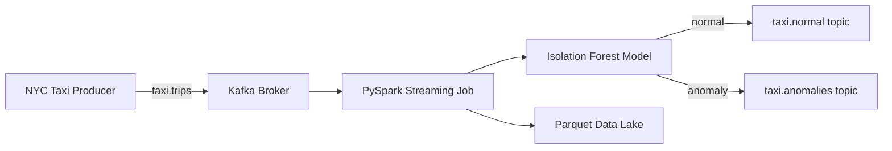

# NYC Taxi Trip Anomaly Detector

A production-grade real-time streaming pipeline that ingests NYC taxi trip data via Apache Kafka, processes it with PySpark Streaming, and detects anomalous trips using an Isolation Forest model — surfacing results to a downstream alert topic.

## Architecture

```
┌─────────────────┐     ┌──────────────┐     ┌─────────────────────┐
│  NYC Taxi Data  │────▶│ Kafka Topic  │────▶│  PySpark Streaming  │
│  (Producer)     │     │ taxi.trips   │     │  (Micro-batch)      │
└─────────────────┘     └──────────────┘     └────────┬────────────┘
                                                       │
                                              ┌────────▼────────────┐
                                              │  Isolation Forest   │
                                              │  Anomaly Detector   │
                                              └────────┬────────────┘
                                                       │
                              ┌────────────────────────┼─────────────────────────┐
                              │                         │                         │
                     ┌────────▼──────┐       ┌─────────▼──────┐    ┌─────────────▼───┐
                     │ Kafka Topic   │       │  Parquet Lake   │    │  Alerts Topic   │
                     │ taxi.normal   │       │  (Delta-ready)  │    │ taxi.anomalies  │
                     └───────────────┘       └────────────────┘    └─────────────────┘
```



## Tech Stack

| Component          | Technology                          |
|--------------------|-------------------------------------|
| Message Broker     | Apache Kafka 3.x                    |
| Stream Processing  | PySpark Structured Streaming        |
| Anomaly Detection  | scikit-learn Isolation Forest       |
| Data Serialization | JSON / Avro-compatible schema        |
| Storage            | Parquet (Delta Lake ready)          |
| Orchestration      | Python asyncio producer             |
| Testing            | pytest + pytest-mock                |
| Linting            | ruff + mypy                         |
| CI/CD              | GitHub Actions                      |

## Features

- **Real-time ingestion**: Kafka producer streams synthetic NYC taxi trips at configurable rates
- **Micro-batch processing**: PySpark Structured Streaming with configurable trigger intervals
- **ML anomaly detection**: Pre-trained Isolation Forest model detects outlier trips (fare, distance, duration)
- **Dual-sink output**: Normal trips → `taxi.normal`, anomalies → `taxi.anomalies`
- **Parquet checkpointing**: All processed data persisted to local/S3 Parquet with watermarking
- **Observability**: Structured JSON logging with trip counts, anomaly rates, and processing latency
- **Graceful shutdown**: Signal handling for clean Kafka consumer/producer teardown

## Sample Output

```
2026-04-04 12:00:01 INFO  Batch #1 processed: 142 trips, 7 anomalies (4.9%)
2026-04-04 12:00:01 INFO  Anomaly: trip_id=TXN-8821 fare=$312.50 distance=0.3mi duration=127min score=-0.41
2026-04-04 12:00:01 INFO  Anomaly: trip_id=TXN-9103 fare=$2.00  distance=48.2mi duration=12min  score=-0.38
```

## Setup

### Prerequisites

- Python 3.11+
- Docker + Docker Compose (for Kafka)
- Java 11+ (for Spark)

### Installation

```bash
git clone https://github.com/naveenkanaparthi-git/nyc-taxi-anomaly-detector
cd nyc-taxi-anomaly-detector
cp .env.example .env
make install
```

### Running with Docker Kafka

```bash
docker-compose up -d
make train
make run-consumer   # terminal 1
make run-producer   # terminal 2
```

### Running Tests

```bash
make test
make lint
```

## Configuration

| Variable | Default | Description |
|----------|---------|-------------|
| `KAFKA_BOOTSTRAP_SERVERS` | `localhost:9092` | Kafka broker address |
| `KAFKA_INPUT_TOPIC` | `taxi.trips` | Input topic name |
| `KAFKA_OUTPUT_NORMAL_TOPIC` | `taxi.normal` | Normal trips output topic |
| `KAFKA_OUTPUT_ANOMALY_TOPIC` | `taxi.anomalies` | Anomaly alerts topic |
| `SPARK_TRIGGER_INTERVAL` | `30 seconds` | Micro-batch trigger interval |
| `MODEL_PATH` | `models/isolation_forest.pkl` | Path to serialized model |
| `PARQUET_OUTPUT_PATH` | `data/output/` | Parquet sink directory |
| `ANOMALY_CONTAMINATION` | `0.05` | Expected anomaly fraction (0–0.5) |
| `PRODUCER_RATE_PER_SEC` | `50` | Trips published per second |

## Project Structure

```
nyc-taxi-anomaly-detector/
├── src/
│   ├── producer/taxi_producer.py      # Async Kafka producer
│   ├── consumer/spark_consumer.py     # PySpark Structured Streaming job
│   ├── detector/
│   │   ├── model.py                   # Isolation Forest wrapper
│   │   └── trainer.py                 # Model training pipeline
│   └── utils/
│       ├── config.py                  # Env-var configuration
│       ├── logging_config.py          # Structured JSON logging
│       └── schema.py                  # Pydantic trip schema
├── tests/
│   ├── conftest.py
│   ├── test_detector.py
│   ├── test_producer.py
│   └── test_schema.py
├── data/sample/taxi_trips_sample.json
├── docs/architecture.md
├── .github/workflows/ci.yml
├── docker-compose.yml
├── Makefile
├── requirements.txt
├── .env.example
└── LICENSE
```

## License

MIT — see [LICENSE](LICENSE)
